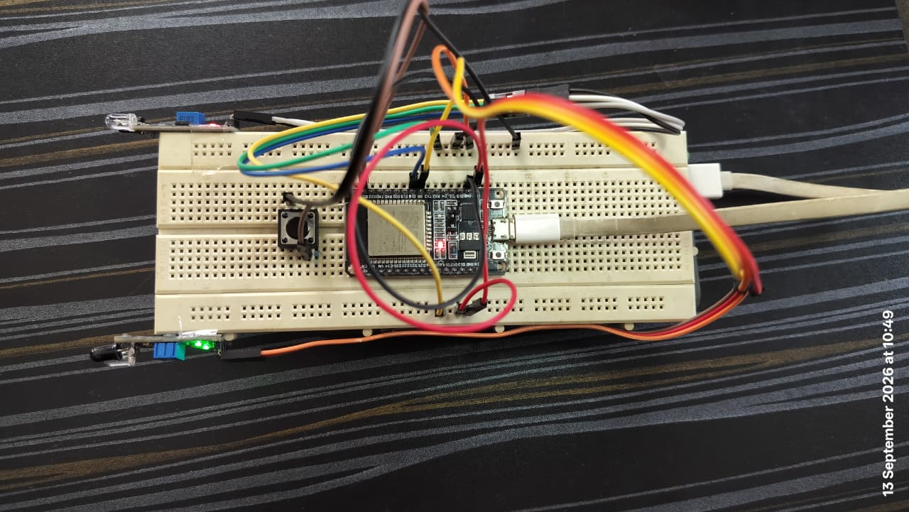
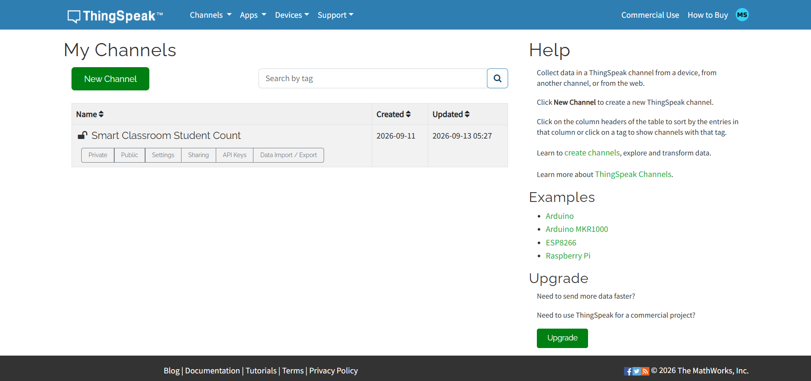
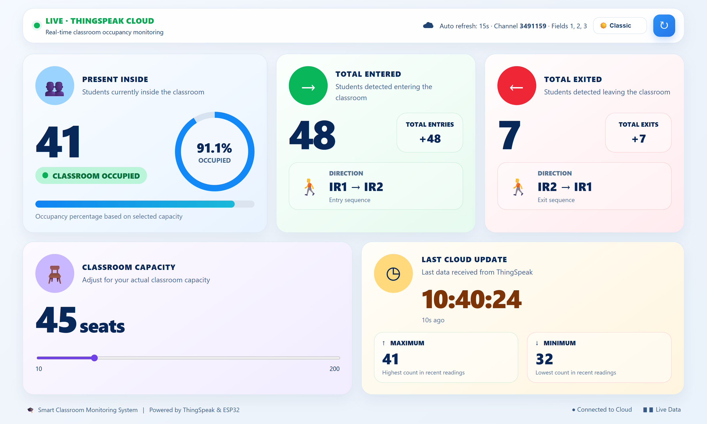

# Smart Classroom Occupancy Monitoring System

A smart classroom occupancy monitoring system using an ESP32, two IR sensors, ThingSpeak Cloud, and a web-based dashboard.

> **Project Type:** Academic Assignment Project  
> **Controller:** ESP32  
> **Cloud Platform:** ThingSpeak  
> **Dashboard:** HTML, CSS and JavaScript

---
## 🚀 Live Dashboard

Access the live Smart Classroom Monitoring Dashboard:

👉 **[Open Live Dashboard](https://shaikmuzahidbasha-art.github.io/smart-classroom-monitor/)**

## 1. Project Overview

The Smart Classroom Occupancy Monitoring System automatically monitors the number of students inside a classroom.

Two IR sensors are placed at the entrance. The ESP32 determines the direction of movement from the order in which the sensors are triggered.

### Entry

```text
IR1 → IR2
```

The system identifies this sequence as a student entering.

### Exit

```text
IR2 → IR1
```

The system identifies this sequence as a student exiting.

The ESP32 maintains three main values:

- Present Inside
- Total Entered
- Total Exited

The values are saved locally in the ESP32's non-volatile memory using the `Preferences` library and are also uploaded to ThingSpeak Cloud when Wi-Fi is available.

The web dashboard retrieves the ThingSpeak channel data and uses it for visualization.

---

## 2. System Architecture

```text
        IR1 Sensor
            │
            │
            ▼
        ┌────────┐
        │  ESP32 │
        └────────┘
            ▲
            │
        IR2 Sensor
            │
            ▼
   Entry / Exit Detection
            │
            ▼
     Occupancy Counters
            │
       ┌────┴────┐
       │         │
       ▼         ▼
 Preferences   Wi-Fi
   (ESP32)       │
       │         ▼
       │    ThingSpeak Cloud
       │         │
       │         ▼
       └──► Web Dashboard
              │
              ▼
       Visualized Data
```

---

## 3. Hardware Components

- ESP32 development board
- Two IR sensors
- Push button for clearing/resetting counters
- Breadboard/prototyping setup
- Jumper/connecting wires
- USB cable
- Computer/Laptop

The ESP32 is the main controller of the system.

---

## 4. ESP32 Pin Configuration

The current firmware uses:

| Component | ESP32 GPIO |
|---|---:|
| IR Sensor 1 | GPIO 5 |
| IR Sensor 2 | GPIO 18 |
| Clear Button | GPIO 23 |

The clear button is connected between **GPIO 23 and GND**.

The firmware uses:

```cpp
pinMode(CLEAR_BUTTON_PIN, INPUT_PULLUP);
```

Therefore, the button is normally HIGH and becomes LOW when pressed.

---

## 5. ESP32 Functions

The ESP32 performs the following functions:

1. Reads the IR sensor inputs.
2. Determines the movement direction.
3. Detects student entry.
4. Detects student exit.
5. Updates classroom occupancy.
6. Updates total entry count.
7. Updates total exit count.
8. Saves counter values to non-volatile memory.
9. Restores saved values after restart.
10. Connects to Wi-Fi.
11. Uploads data to ThingSpeak.
12. Displays system information through the Serial Monitor.
13. Clears the stored counters when the clear button is pressed.

---

## 6. Entry and Exit Detection

The system uses the order of sensor activation to determine the direction of movement.

### Student Entry

```text
IR1 triggered
      ↓
IR2 triggered
      ↓
ENTRY DETECTED
      ↓
Present Inside + 1
Total Entered + 1
      ↓
Save to ESP32 memory
```

### Student Exit

```text
IR2 triggered
      ↓
IR1 triggered
      ↓
EXIT DETECTED
      ↓
Present Inside - 1
Total Exited + 1
      ↓
Save to ESP32 memory
```

The firmware uses a short detection window to determine whether the second sensor is triggered after the first sensor.

---

## 7. Counters

The system maintains three primary counters.

### Present Inside

The current number of students inside the classroom.

### Total Entered

The total number of detected entry events.

### Total Exited

The total number of detected exit events.

The basic relationship is:

```text
Present Inside = Total Entered - Total Exited
```

For example:

```text
Total Entered = 12
Total Exited  = 8

Present Inside = 12 - 8
               = 4
```

---

## 8. Empty Classroom Protection

The system prevents the occupancy count from becoming negative.

If:

```text
Present Inside = 0
```

and an exit sequence is detected, the exit is ignored.

The Serial Monitor reports:

```text
>>> EXIT IGNORED - ROOM EMPTY <<<
```

This protects the system from producing an invalid negative occupancy value.

---

## 9. Counter Reset Button

A push button is connected to:

```text
GPIO 23 → Push Button → GND
```

When the button is pressed, the system clears all three counters:

```text
Present Inside : 0
Total Entered  : 0
Total Exited   : 0
```

The zero values are also saved to the ESP32's non-volatile storage.

Therefore, after a reset, the cleared state remains even if the ESP32 is restarted or powered off.

---

## 10. ESP32 Non-Volatile Storage

The firmware uses:

```cpp
#include <Preferences.h>
```

The `Preferences` library provides access to ESP32 non-volatile storage (NVS).

The project saves:

```text
present
entered
exited
```

to a storage namespace called:

```text
classroom
```

After every valid entry or exit, the updated counters are saved immediately.

When the ESP32 starts, the previously saved values are loaded.

### Example

Before power loss:

```text
Present Inside : 8
Total Entered  : 20
Total Exited   : 12
```

After the ESP32 is powered on again:

```text
SAVED DATA RESTORED

Present Inside : 8
Total Entered  : 20
Total Exited   : 12
```

This means the current implementation preserves the counter values across normal ESP32 restart and power loss.

---

## 11. Wi-Fi Connectivity

The ESP32 connects to a Wi-Fi network to communicate with ThingSpeak.

The firmware attempts to connect to Wi-Fi during startup.

If the connection is unavailable, the system reports:

```text
WiFi connection failed.
Counting will continue locally.
```

The ESP32 can therefore continue processing sensor events while Wi-Fi is unavailable, provided that the ESP32 itself remains powered.

---

## 12. What Happens if Wi-Fi Connection Is Lost?

Wi-Fi loss does **not** erase the counter values.

The ESP32 continues to maintain and save the counters locally using non-volatile storage.

For example:

```text
Before Wi-Fi loss:

Present Inside : 5
Total Entered  : 10
Total Exited   : 5
```

If Wi-Fi is disconnected and three more students enter:

```text
ESP32 local memory:

Present Inside : 8
Total Entered  : 13
Total Exited   : 5
```

The ESP32 keeps these values locally.

However, ThingSpeak cannot receive new updates while the network connection is unavailable.

When Wi-Fi becomes available again, the ESP32 can upload the current counter values to ThingSpeak.

### Important

The current firmware saves the **latest counter state** locally. It does not maintain a separate queue of every individual ThingSpeak update that was missed during the network outage.

---

## 13. What Happens if Power Is Lost?

The counters are stored using ESP32 non-volatile storage rather than only normal runtime variables.

Therefore:

```text
Power OFF
   ↓
ESP32 loses power
   ↓
Power ON
   ↓
Preferences loads saved values
   ↓
Previous counters restored
```

For example:

```text
Before power loss:

Present Inside : 8
Total Entered  : 20
Total Exited   : 12
```

After restart:

```text
Present Inside : 8
Total Entered  : 20
Total Exited   : 12
```

The stored values remain until they are explicitly changed or cleared.

---

## 14. Important Difference: ESP32 Storage vs ThingSpeak Storage

The project has two different storage layers.

### ESP32 Local Storage

Stores the latest counter state using non-volatile memory.

```text
Present Inside
Total Entered
Total Exited
```

These values survive restart and power loss.


### ThingSpeak Cloud

Stores uploaded cloud readings.

```text
ESP32 → Wi-Fi → ThingSpeak
```

ThingSpeak retains previously uploaded cloud data even if the ESP32 is temporarily offline.

However, ThingSpeak data does not automatically overwrite or restore the ESP32's local counters in the current firmware.

---

## 15. ThingSpeak Cloud Integration

ThingSpeak is used as the cloud platform for storing and accessing classroom monitoring data.

The ESP32 sends the counter values to the ThingSpeak channel when Wi-Fi is available.

The channel uses three fields:

| ThingSpeak Field | Data |
|---|---|
| Field 1 | Present Inside |
| Field 2 | Total Entered |
| Field 3 | Total Exited |

The cloud data can be viewed through the ThingSpeak channel.

---

## 16. ThingSpeak Update Interval

The firmware attempts to update ThingSpeak every:

```text
15 seconds
```

The interval is controlled by:

```cpp
const unsigned long uploadInterval = 15000;
```

The ESP32 sends the current values to ThingSpeak:

```text
Field 1 → Present Inside
Field 2 → Total Entered
Field 3 → Total Exited
```

A successful update is reported by:

```text
ThingSpeak Update Successful
```

---

## 17. Cloud-to-Dashboard Data Flow

One of the main features of this project is the use of cloud data in the web dashboard.

The dashboard does not manually contain the classroom readings.

Instead, it retrieves the data from the ThingSpeak channel.

```text
IR Sensors
     ↓
ESP32
     ↓
Sensor Processing
     ↓
Counter Values
     ↓
ThingSpeak Cloud
     ↓
ThingSpeak Channel Data
     ↓
JavaScript
     ↓
Web Dashboard
     ↓
Visualization
```

This separates the physical sensing system from the visualization interface.

---

## 18. Web Dashboard

The web dashboard is located at:

```text
code/Web_Dashboard/index.html
```

The dashboard provides a visual representation of the classroom monitoring information.

The dashboard retrieves data from the ThingSpeak channel and uses the received values to update the displayed information.

---

## 19. Dashboard Features

The dashboard provides visual information such as:

- Present Inside
- Total Entered
- Total Exited
- Classroom Capacity
- Occupancy Percentage
- Classroom Occupancy Status
- Latest Movement Direction
- Last Cloud Update
- Minimum Occupancy
- Maximum Occupancy
- Responsive/mobile layout
- Multiple visual themes

---

## 20. Occupancy Percentage

The dashboard can calculate classroom occupancy percentage using:

```text
Occupancy Percentage =
(Present Inside / Classroom Capacity) × 100
```

For example:

```text
Present Inside = 4
Classroom Capacity = 45

Occupancy Percentage =
(4 / 45) × 100

≈ 8.9%
```

---

## 21. Dashboard Movement Direction

The dashboard can represent the detected movement direction.

### Entry

```text
IR1 → IR2
```

### Exit

```text
IR2 → IR1
```

This provides additional information about the latest detected movement.

---

## 22. Dashboard Themes

The dashboard includes multiple visual themes for demonstration and usability.

The project screenshots demonstrate different dashboard appearances and operating conditions, including:

- Normal operation
- Classic theme
- Neon theme
- Empty classroom
- Capacity alert
- Mobile/responsive view

---

## 23. Responsive Dashboard

The dashboard is designed to adapt to different screen sizes.

It can be viewed on:

- Desktop
- Laptop
- Tablet
- Mobile devices

The layout adjusts according to the available screen size.

---

## 24. Dashboard Technologies

### HTML

Used to create the dashboard structure.

### CSS

Used for:

- Layout
- Cards
- Spacing
- Typography
- Responsive design
- Themes
- Visual presentation

### JavaScript

Used to:

- Request ThingSpeak channel data
- Process cloud responses
- Update dashboard values
- Calculate occupancy information
- Refresh cloud data
- Handle dashboard interactions

---

## 25. Serial Monitor

The Arduino IDE Serial Monitor is used to verify system operation.

The baud rate is:

```text
115200
```

The Serial Monitor can show:

- Wi-Fi connection status
- Restored saved data
- Student entry
- Student exit
- Current occupancy
- Total entry count
- Total exit count
- Ignored exit when the room is empty
- ThingSpeak update status

Example:

```text
SAVED DATA RESTORED

Present Inside : 4
Total Entered  : 12
Total Exited   : 8
```

---

## 26. Hardware Testing

The hardware was tested for:

- IR sensor operation
- Entry detection
- Exit detection
- Direction detection
- Occupancy updates
- Entry counter
- Exit counter
- Empty-room protection
- Counter reset button
- Data persistence
- Wi-Fi connectivity
- ThingSpeak communication

---

## 27. Cloud Testing

The ESP32 was tested for successful communication with ThingSpeak.

The Serial Monitor provides confirmation such as:

```text
ThingSpeak Update Successful
```

The uploaded values can then be viewed in the ThingSpeak channel.

---

## 28. Dashboard Testing

The dashboard was tested using data retrieved from ThingSpeak.

Testing includes:

- Normal classroom operation
- Different occupancy values
- Entry and exit changes
- Empty classroom
- Classroom capacity conditions
- Capacity alert
- Cloud data updates
- Different dashboard themes
- Responsive/mobile layout

---

## 29. Project Folder Structure

```text
Smart_Classroom_Monitoring/
│
├── code/
│   │
│   ├── ESP32/
│   │   └── Smart_classroom_Occupancy.ino
│   │
│   └── Web_Dashboard/
│       └── index.html
│
├── images/
│   │
│   ├── hardware/
│   │
│   └── screenshots/
│       │
│       ├── serial_monitor/
│       │
│       ├── thingspeak_cloud/
│       │
│       └── web_dashboard/
│
├── .gitignore
└── README.md
```

---

## 30. ESP32 Source Code

The ESP32 firmware is located at:

```text
code/ESP32/Smart_classroom_Occupancy.ino
```

The firmware contains the logic for:

- Sensor input
- Entry detection
- Exit detection
- Occupancy counting
- Entry/exit totals
- Counter reset
- Non-volatile data storage
- Saved data restoration
- Wi-Fi connection
- ThingSpeak communication
- Serial Monitor output

---

## 31. Web Dashboard Source Code

The dashboard source is located at:

```text
code/Web_Dashboard/index.html
```

The single HTML file contains:

- HTML structure
- CSS styling
- JavaScript functionality
- ThingSpeak data retrieval
- Dashboard calculations
- Visual dashboard updates
- Theme functionality

---

## 32. How to Run the ESP32 Code

1. Install Arduino IDE.
2. Install ESP32 board support.
3. Open:

```text
code/ESP32/Smart_classroom_Occupancy.ino
```

4. Select the appropriate ESP32 board.
5. Select the correct COM port.
6. Configure the required Wi-Fi and ThingSpeak credentials locally.
7. Upload the program.
8. Open the Serial Monitor.
9. Set the baud rate to:

```text
115200
```

10. Test the IR sensor entry and exit sequences.

---

## 33. How to Open the Web Dashboard

Open:

```text
code/Web_Dashboard/index.html
```

in a modern web browser.

The dashboard retrieves the required channel data from ThingSpeak and displays it visually.

The required ThingSpeak channel configuration and access information must be correctly configured for the dashboard to retrieve the expected data.

---

## 34. Security and Credentials

Sensitive credentials are intentionally excluded from the public repository.

Do not commit or publicly share:

- Wi-Fi password
- ThingSpeak Write API Key
- ThingSpeak Read API Key when private access is used
- Private tokens
- Other authentication credentials

Use placeholders in publicly shared code.

Example:

```cpp
const char* ssid = "YOUR_WIFI_NAME";
const char* password = "YOUR_WIFI_PASSWORD";
```

For GitHub, the real credentials should be kept outside the repository.

---

## 35. Project Images

### Hardware

Hardware setup images are stored in:

```text
images/hardware/
```

### Serial Monitor

Serial Monitor screenshots are stored in:

```text
images/screenshots/serial_monitor/
```

### ThingSpeak Cloud

ThingSpeak screenshots are stored in:

```text
images/screenshots/thingspeak_cloud/
```

These demonstrate the ThingSpeak channel, cloud configuration, and stored/visualized data.

### Web Dashboard

Dashboard screenshots are stored in:

```text
images/screenshots/web_dashboard/
```

These demonstrate the dashboard interface, themes, operating conditions, and responsive layout.

---

## 36. Complete System Workflow

```text
1. Student approaches the entrance
                    ↓
2. IR sensors detect movement
                    ↓
3. ESP32 determines sensor sequence
                    ↓
4. Entry or exit is identified
                    ↓
5. Occupancy counters are updated
                    ↓
6. Updated counters are saved to ESP32 NVS
                    ↓
7. If Wi-Fi is available, data is sent to ThingSpeak
                    ↓
8. ThingSpeak stores the cloud reading
                    ↓
9. Web dashboard requests channel data
                    ↓
10. JavaScript processes the cloud response
                    ↓
11. Dashboard updates the visual interface
```

---

## 37. Example

Suppose the system detects:

```text
Total Entered = 12
Total Exited  = 8
```

Then:

```text
Present Inside = 12 - 8
               = 4
```

If classroom capacity is 45:

```text
Occupancy Percentage ≈ 8.9%
```

The ESP32 saves the current values locally, while the latest successful upload is also available through ThingSpeak.

---

## 38. Technologies Used

| Technology | Purpose |
|---|---|
| ESP32 | Main IoT controller |
| IR Sensors | Entry and exit detection |
| Push Button | Counter reset |
| Preferences / NVS | Persistent ESP32 counter storage |
| Arduino IDE | ESP32 programming |
| C/C++ | ESP32 firmware |
| Wi-Fi | Internet connectivity |
| ThingSpeak | Cloud storage and data access |
| HTML | Dashboard structure |
| CSS | Dashboard design |
| JavaScript | Cloud data retrieval and visualization |

---

## 39. Key Features

- Automatic entry detection
- Automatic exit detection
- Direction detection using sensor sequence
- Current occupancy calculation
- Total entry counter
- Total exit counter
- Empty-room exit protection
- Push-button counter reset
- Persistent ESP32 counter storage
- Data restoration after restart
- Data retention after power loss
- Local counting during Wi-Fi loss
- ThingSpeak cloud integration
- Cloud data storage
- Cloud-to-dashboard data retrieval
- Automatic dashboard data refresh
- Visual occupancy monitoring
- Classroom capacity monitoring
- Occupancy percentage
- Last cloud update information
- Responsive web dashboard
- Multiple dashboard themes
- Serial Monitor debugging

---

## 40. Project Objective

The objective of this assignment project is to demonstrate the integration of:

```text
Sensors
   +
Microcontroller
   +
Non-Volatile Storage
   +
Wi-Fi
   +
Cloud Platform
   +
Web Technologies
```

to create an IoT-based classroom occupancy monitoring system.

---

## 41. Conclusion

The Smart Classroom Occupancy Monitoring System demonstrates a complete IoT data pipeline from physical sensing to local persistent storage, cloud storage, and web-based visualization.

The ESP32 detects student movement using two IR sensors and determines whether a student has entered or exited based on the sensor sequence.

The current occupancy, total entries, and total exits are saved using ESP32 non-volatile storage, allowing the values to survive restart and power loss.

When Wi-Fi is available, the ESP32 uploads the current values to ThingSpeak Cloud.

The web dashboard retrieves the ThingSpeak channel data and converts it into a visual interface showing classroom occupancy, total entries, total exits, capacity, movement direction, cloud update information, and different dashboard themes.

The project demonstrates the practical integration of embedded systems, persistent data storage, IoT communication, cloud services, and web technologies in a classroom monitoring application.

---

## 42. Project Status

This project has been implemented and tested as an academic assignment project.

The repository contains:

- ESP32 firmware
- Web dashboard
- Hardware setup images
- Serial Monitor screenshots
- ThingSpeak Cloud screenshots
- Web dashboard screenshots
- Project documentation

---
## 👥 Team Members

| Team Member |
|---|
| SHAIK MUZAHID BASHA |
| SUDHARSAN S |
| RAJKUMAR M P |

## License

This project is intended for academic and educational purposes.
